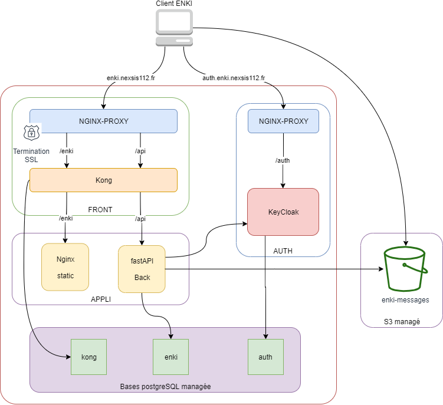

# ENKI

## Description
ENKI est enki.

## Stratégie d’architecture et de sécurité
* Plateforme cloud
* point unique de terminaison SSL
* stockage S3 pour les medias

## Vue fonctionnelle

## Vue logicielle

Le schéma suivant montre l'architecture logicielle et les composants utilisés :

## Composants techniques
Les composants utilisés dans enki sont :

* FRONT : 
    * Serveur web : NGINX
    * API Gateway : Kong
* AUTH :
    * IDP : Keycloak
* APPLI :
    * Contenu statique : NGINX
    * API Enki : Python
* DB(s) :
    * Bases de données managées PostgreSQL

Le tableau suivant décrit les détails et versions respectives :

| Serveur | Type | Composant | Version | Commentaires |
|---------|------|-----------|---------|--------------|
| FRONT | OS | debian | 10.8 | |
|  | Reverse proxy | NGINX | 2.4.6 | |
|  | | | | |
| AUTH | OS | debian | 10.8 | |
|  | JVM | OpenJDK |  1.8.0.232 | |
|  | IDP | KEYCLOAK | 1.0 | |
|  | | | | |
| APP | OS | CentOS | 7.5 | |
|  | FRONT | Nginx | 1.16 | |
|  | BACK | API | 1.16 | |
|  | | | | |

## Vue technique
L'architecture technique est illustrée dans la figure suivante :

## Réseau et Flux

### Accès

| Clients | endpoint                         |
| ----------------- | -------------------------------- | 
| Internet    | https://api.enki-crise.fr  | 

### Tableau de flux 
| N°  | Source | Protocole:port | réseau | Destination | Protocole:port | réseau | Description |
|-----|--------|----------------|------|-------------|----------------|------|-------------|
| 1   | Client | ANY | Internet | front | HTTPS:443 (TCP) | Interne |  Flux HTTPS client |

## Dimensionnement

La plateforme de dev est dimensionnée de la façon suivante :

| Serveur | Nb VM | vCPU | Mémoire | Disque (/data) | Commentaires |
|---------|-------|------|---------|--------|--------------|
| FRONT | 1 | 2 vCPU | 2 Go | 20 Go | |
| AUTH | 1 | 2 vCPU | 2 Go | 20 Go | |
| APPLI | 1 | 4 vCPU | 8 Go | 80 Go | |
| BDD | 1 | 2 vCPU | 2 Go | 50 Go | |